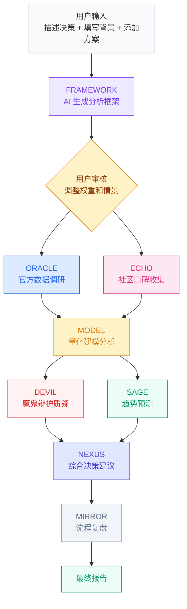

# AI Decision Engine | AI 决策引擎

> 把复杂决策从"让 AI 给建议"，变成"建立假设、计算效用、检查风险、输出报告"。

使用方法：解压文件夹到本地后运行 `server.py`，然后浏览器打开 http://localhost:3456

---

## 为什么做这个项目？

很多人现在用 AI 做决策，本质上还是在和 LLM 聊天。你怎么提问、怎么描述背景、怎么暗示偏好，都会影响它最后给出的建议。

更重要的是，人本身不可能是全知全能的。你在输入提示词的时候，已经带着自己的信息盲区、表达偏好和判断偏误。LLM 如果只是顺着你的提示词往下分析，就很容易把这些偏误进一步放大。

还有一些工具会组织一个 agent team，让不同角色分别发表意见。这个形式可以提供更多视角，但它本质上仍然是多个 LLM 在生成文本分析，并不等于真正的理性决策。

更理性的决策过程，应该把收益、风险、概率、个人偏好和机会成本放进同一个框架里计算。比如投资里会看收益、波动、夏普比率和最大回撤；经济学里会看预算约束、效用函数和无差异曲线；现实决策里也应该问：哪个选项带来的效用更高？风险是否可接受？如果关键假设变了，结论会不会翻转？

AI Decision Engine 就是为这个目的做的：LLM 负责把问题结构化，Python 负责做可复现的数值仿真，人负责检查假设是否合理。

---

## 这个项目是什么？

AI Decision Engine 是一个本地运行的 AI 决策分析工具。它不会直接让 AI 给你一个"我建议你选 A"的答案，而是把一个复杂决策拆成一条流水线：

1. 输入决策问题、背景和候选选项
2. AI 生成评估维度、风险因素和情景假设
3. 用户检查并修改这些假设
4. AI 把前面的信息转成可计算的模型参数
5. Python 后端运行 Monte Carlo 仿真
6. 系统输出各选项的效用分布、风险区间和排序
7. 反方 agent 检查这个结论有没有被某些假设带偏
8. 最后生成一份完整的决策报告

---

## 动态决策建模

传统决策工具通常需要用户一步步填表：有哪些选项、有哪些指标、每个指标权重是多少、每种情况概率是多少。

这个方式的问题是：表本身已经预设了决策结构。用户如果不知道该填什么、漏掉了关键变量，后面的计算再精确也没有意义。

AI Decision Engine 的做法不同。你只需要输入自然语言描述，AI 会根据具体语境生成适合这个问题的决策结构。不同问题会得到不同的评估维度、候选选项、风险变量、未来情景和效用指标。

比如：

- **选学校**，系统会更关注专业质量、城市、成本、就业路径和长期机会
- **换工作**，系统会更关注薪资、成长性、稳定性、行业风险和机会成本
- **投资方案比较**，系统会更关注收益分布、波动、尾部风险和流动性
- **创业决策**，系统会更关注市场规模、执行难度、现金流、失败成本和可选路径

---

## 它能解决什么问题？

它适合处理各种需要在不确定性下比较多个方案的问题，比如：

- 选学校、选专业、选城市
- 要不要换工作、转行、创业
- 多个投资方案或资源分配方案的比较
- 长期职业路径选择
- 高不确定性、高机会成本的个人决策
- 约会去什么地方
- 中午吃什么

如果一个问题有明确标准答案，用搜索或者普通 LLM 就够了。如果一个问题没有标准答案，而是要在多个不确定选项之间做取舍，那么它更适合用 AI Decision Engine 来分析。

---

## 决策流水线



---

## 六步决策，步步有据

### Step 1 — 你说，AI 听

告诉 AI 你在纠结什么。AI 会根据你的决策类型**自动生成个性化表单** —— 选学校和选工作问的问题完全不同。

### Step 2 — AI 搭框架，你来定

AI 生成完整分析框架：评估维度、情景假设、权重分配。**弹窗展示，你亲手调参**，确认后才继续。这不是黑箱，你掌握方向盘。

### Step 3 — 双线调研，交叉验证

两个 Agent 同时出击：
- **ORACLE** 查官方数据：费用、政策、录取率、就业数据
- **ECHO** 扫社区口碑：论坛、社交媒体上真实用户怎么说

### Step 4 — 量化建模，不靠感觉

基于调研数据，跑 **蒙特卡洛模拟**：
- 审计层评分（每个维度 0-100）
- 多情景分析（经济好/差/政策变动各种假设）
- 效用函数排名（不只看收益，还看风险和尾部损失）
- 敏感性分析（哪个假设变了，结论就翻了）

### Step 5 — 挑刺 + 预测

又是两个 Agent 同时上：
- **DEVIL** 魔鬼辩护：专门攻击排名第一的选项，替最后一名辩护，找最脆弱的假设
- **SAGE** 趋势预测：5-10年维度看签证政策、行业走向、市场周期

### Step 6 — 一锤定音

**NEXUS** 整合前面所有 Agent 的输出，给出最终建议。**MIRROR** 复盘整个流程，标记盲点和信息缺口。

输出一份完整报告：结论、排名、理由、行动计划、截止日期。

---

## 智能体团队

| 智能体 | 身份 | 做什么 |
|:---:|:---|:---|
| **FRAMEWORK** | 框架架构师 | 根据你的情况动态生成评估维度、情景假设、权重 |
| **ORACLE** | 官方研究员 | 核实费用、政策、课程、就业等硬数据 |
| **ECHO** | 口碑情报员 | 搜集论坛、社交媒体上的真实评价和吐槽 |
| **MODEL** | 量化分析师 | 蒙特卡洛模拟 + 审计评分 + 效用函数排名 |
| **DEVIL** | 魔鬼辩护人 | 质疑假设、找逻辑漏洞、防幸存者偏差 |
| **SAGE** | 趋势预测师 | 分析未来5-10年政策、行业、市场走向 |
| **NEXUS** | 决策架构师 | 整合所有输入，做最终决策建议 |
| **MIRROR** | 流程复盘师 | 审查分析质量，标记盲点和信息缺口 |

---

## 快速开始

```bash
# 1. 确保已安装 Python 3.8+（仅用标准库，无需 pip install）
python --version

# 2. 启动本地服务器
python server.py

# 3. 浏览器打开
# http://localhost:3456
```

需要任一 AI 服务商的 API Key:**OpenAI** · **DeepSeek** · **Gemini** · **Anthropic** · 或任何 **OpenAI 兼容** 接口。


---

## 设计原则

| 原则 | 说明 |
|:---|:---|
| **零硬编码** | 维度、情景、权重全部根据你的情况动态生成，不用模板 |
| **断点续跑** | 已完成步骤自动缓存，中途失败从断点恢复，不浪费 API 调用 |
| **全程透明** | 每个 Agent 的原始输出都能在活动面板查看 |
| **隐私优先** | 个人数据留在本地 `input/`（已 gitignore），仓库只有框架 |
| **一键启动** | 纯 Python 标准库，不需要装任何依赖 |

---

## 项目结构

```
index.html          ← 前端界面（单文件，开箱即用）
prompts.js          ← 8个 Agent 的提示词
server.py           ← 本地代理服务器（API 中转 + /api/simulate 端点）
simulator.py        ← 蒙特卡洛仿真引擎（纯 Python 标准库，确定性计算）
templates/          ← sim_spec 契约示例
input/              ← 用户数据（gitignore，本地保留）
data/               ← 中间分析结果（gitignore）
output/             ← 最终报告（gitignore）
```

## License

MIT
