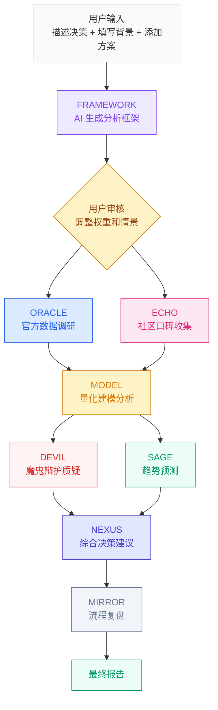

# AI Decision Engine | AI 决策引擎

> **一个决策，8个AI，一份报告。**

---
使用方法：解压文件夹到本地后运行server.py文件，然后打开浏览器输入http://localhost:3456

### 传统 AI 做决策：

- 单轮对话，基于训练数据"猜"一个答案
- 没有数据验证，不知道信息是否过时
- 不会质疑自己，容易一本正经地胡说八道
- 给你一个"看起来对"的建议，但你不知道它漏掉了什么

### 8-Agent 决策引擎：

- **8个专业AI智能体**分工协作，各司其职
- 先建框架，再调研，再建模，再质疑，最后综合 —— 每一步都有专人负责
- **魔鬼辩护人**专门挑刺，找出你最优选项的隐患
- **趋势预测师**看未来5-10年走向，不只看眼前
- 全程透明：每个Agent的原始输出你都能看到

---

## 决策流水线



---

## 六步决策，步步有据

### Step 1 — 你说，AI 听

告诉 AI 你在纠结什么。AI 会根据你的决策类型**自动生成个性化表单** —— 选学校和选工作问的问题完全不同。

### Step 2 — AI 搭框架，你来定

AI 生成完整分析框架：评估维度、情景假设、权重分配。**弹窗展示，你亲手调参**，确认后才继续。这不是黑箱，你掌握方向盘。

### Step 3 — 双线调研，交叉验证

两个 Agent 同时出击：
- **ORACLE** 查官方数据：费用、政策、录取率、就业数据
- **ECHO** 扫社区口碑：论坛、社交媒体上真实用户怎么说

### Step 4 — 量化建模，不靠感觉

基于调研数据，跑 **蒙特卡洛模拟**：
- 审计层评分（每个维度 0-100）
- 多情景分析（经济好/差/政策变动各种假设）
- 效用函数排名（不只看收益，还看风险和尾部损失）
- 敏感性分析（哪个假设变了，结论就翻了）

### Step 5 — 挑刺 + 预测

又是两个 Agent 同时上：
- **DEVIL** 魔鬼辩护：专门攻击排名第一的选项，替最后一名辩护，找最脆弱的假设
- **SAGE** 趋势预测：5-10年维度看签证政策、行业走向、市场周期

### Step 6 — 一锤定音

**NEXUS** 整合前面所有 Agent 的输出，给出最终建议。**MIRROR** 复盘整个流程，标记盲点和信息缺口。

输出一份完整报告：结论、排名、理由、行动计划、截止日期。

---

## 智能体团队

| 智能体 | 身份 | 做什么 |
|:---:|:---|:---|
| **FRAMEWORK** | 框架架构师 | 根据你的情况动态生成评估维度、情景假设、权重 |
| **ORACLE** | 官方研究员 | 核实费用、政策、课程、就业等硬数据 |
| **ECHO** | 口碑情报员 | 搜集论坛、社交媒体上的真实评价和吐槽 |
| **MODEL** | 量化分析师 | 蒙特卡洛模拟 + 审计评分 + 效用函数排名 |
| **DEVIL** | 魔鬼辩护人 | 质疑假设、找逻辑漏洞、防幸存者偏差 |
| **SAGE** | 趋势预测师 | 分析未来5-10年政策、行业、市场走向 |
| **NEXUS** | 决策架构师 | 整合所有输入，做最终决策建议 |
| **MIRROR** | 流程复盘师 | 审查分析质量，标记盲点和信息缺口 |

---

## 快速开始

```bash
# 1. 确保已安装 Python 3.8+（仅用标准库，无需 pip install）
python --version

# 2. 启动本地服务器
python server.py

# 3. 浏览器打开
# http://localhost:3456
```

需要任一 AI 服务商的 API Key:**OpenAI** · **DeepSeek** · **Gemini** · **Anthropic** · 或任何 **OpenAI 兼容** 接口。


---

## 设计原则

| 原则 | 说明 |
|:---|:---|
| **零硬编码** | 维度、情景、权重全部根据你的情况动态生成，不用模板 |
| **断点续跑** | 已完成步骤自动缓存，中途失败从断点恢复，不浪费 API 调用 |
| **全程透明** | 每个 Agent 的原始输出都能在活动面板查看 |
| **隐私优先** | 个人数据留在本地 `input/`（已 gitignore），仓库只有框架 |
| **一键启动** | 纯 Python 标准库，不需要装任何依赖 |

---

## 项目结构

```
index.html          ← 前端界面（单文件，开箱即用）
prompts.js          ← 8个 Agent 的提示词
server.py           ← 本地代理服务器（API 中转 + /api/simulate 端点）
simulator.py        ← 蒙特卡洛仿真引擎（纯 Python 标准库，确定性计算）
templates/          ← sim_spec 契约示例
input/              ← 用户数据（gitignore，本地保留）
data/               ← 中间分析结果（gitignore）
output/             ← 最终报告（gitignore）
```

## License

MIT
